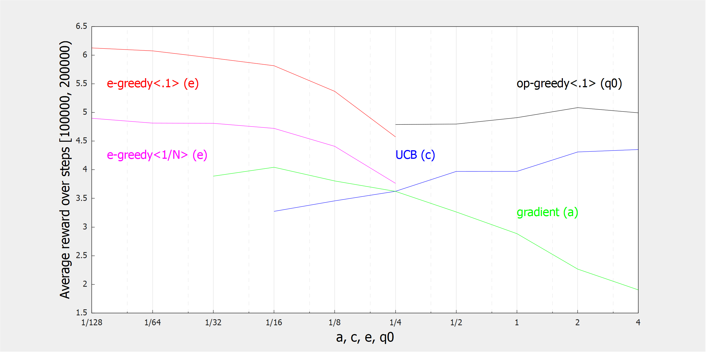

    
     
    <em>
        Plots of the reward, between steps 100,000 and 200,000, given some input
        parameter, averaged over 2,000 agents, each picking from 10 different slot
        machines according to a number of different strategies. The slot machines have a
        reward normally distributed around zero, and will randomly change a small amount
        each turn. 'e-greedy<.1>' and '<1/N>' are e-greedy agents with a constant .1 and
        averaging step size, respectively. 'op-greedy' is a greedy agent that has been
        initialized with optimistic estimates. 'UCB' is a greedy agent that overvalues
        uncertain actions. Finally, 'gradient' is non-greedy, instead selecting actions
        according to a learned softmax distribution. The symbol in parenthesis after each
        is the name of their input parameters, which vary over the x axis.
    </em>

