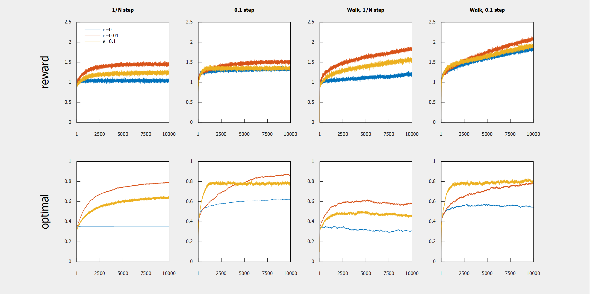

    
     
    <em>
        Plots of the reward and chance of optimal action averaged over 2000 agents
        learning to play 10 slot machines with payouts normally distributed around zero.
        e is the probability per step that each agent will explore instead of selecting
        the best action. Slot machines in columns titled 'walk' will slowly change their
        average payout each turn. Agents in columns titled '1/N step' will value actions
        according to the average return of those actions; in columns titled '0.1 step'
        they will use a weighted average return instead, preferring more recent values.
    </em>

