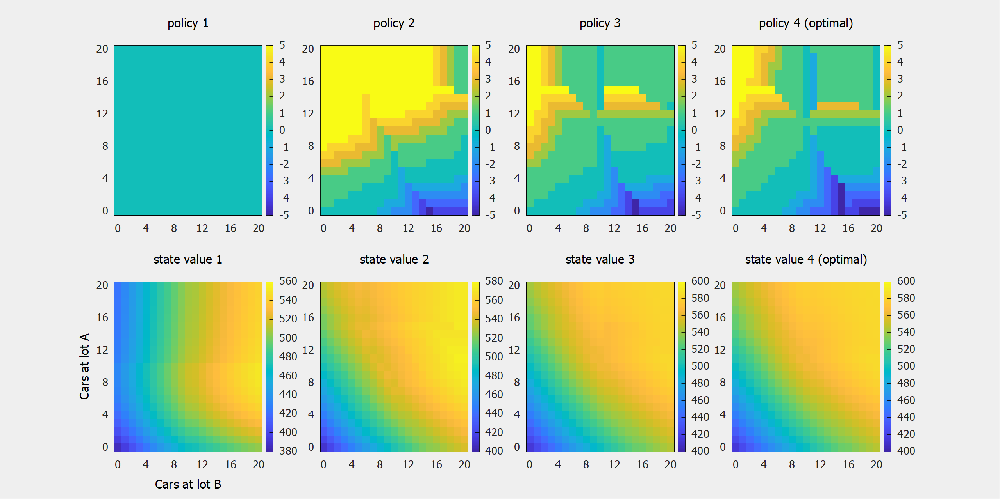

    
     
    <em>
        Consider managing a rental car business, deciding how many cars to move between
        two lots, A and B, with different rates of rentals and returns. A successful
        rental earns $10, $4 is spent for each lot with more than 10 cars overnight, and
        it costs $2 to move each car (though you get one free move per day from A to B).
        These images show a procress called Policy Iteration solving this problem by
        successively improving both a policy and state value estimate, from naive on the
        left, to optimal on the right. Policies are a grid showing how many cars to move
        (with positive values meaning a move from A to B), given how many cars you have
        at each lot. State values are the expected return of following the policy above
        them, again depending on how many cars are at each lot.
    </em>

