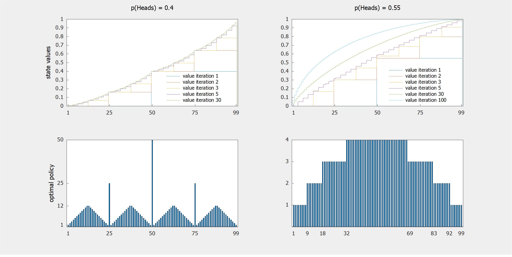

    
     
    <em>
        Consider a simple game: a gambler must decide how much of their capital to stake
        on an unfair coin flip. Heads doubles the stake, tails loses it. The gambler wins
        or loses at $100 or $0, respectively. These images show a process called Value
        Iteration solving this problem. State value estimates are iteratively improved
        until stability; a policy is then chosen to greedily maximize this estimated
        optimal state value. Policies are a graph showing how much a gambler should stake
        given their current capital. State values are the expected return of following
        the best possible action, again depending on the gambler's current capital.
    </em>

