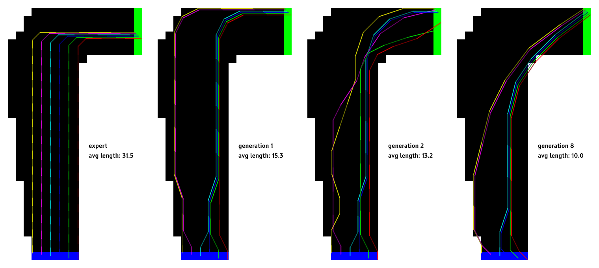

    
     
    <em>
        These images show agents learning to navigate a right turn (from blue to
        green) starting from a hard coded expert. Each generation learns from the prior
        one, with generation 1 learning from the expert. The teaching agent will perform
        10,000,000 episodes (each episode is one turn around the corner) and spend 1% of
        that time exploring. The algorithm estimates the total future reward available
        from each visited state (a position and velocity) by rewinding entire episodes,
        with states on the finish line rewarding 1, and all others rewarding 0. The next
        generation will greedily choose actions that maximize the expected rewards that
        the prior generation encountered, in effect minimizing the expected number of
        steps they take to navigate the turn.
    </em>

