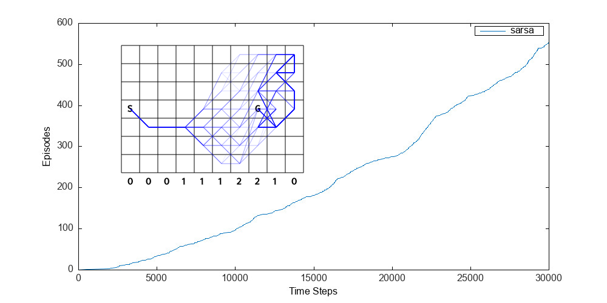

    
     
    <em>
        SARSA updates the action value estimates that control exploration after every
        step, and as a consequence it's able to reach goal states in complicated
        environments without explicit instruction. Here you see the results of SARSA
        learning to navigate a version of the windy world from 6.9, where the agent is
        pushed randomly instead of reliably: if the agent is pushed some amount by the
        wind, it is instead pushed that amount plus some random variable drawn uniformly
        from -1, 0, and 1. The image shows both the learning progress, and 100 runs of a
        trained agent, with darker paths being more commonly used. This complication of
        the environment does, however, double the time it takes to reach 100 completed
        episodes.
    </em>

