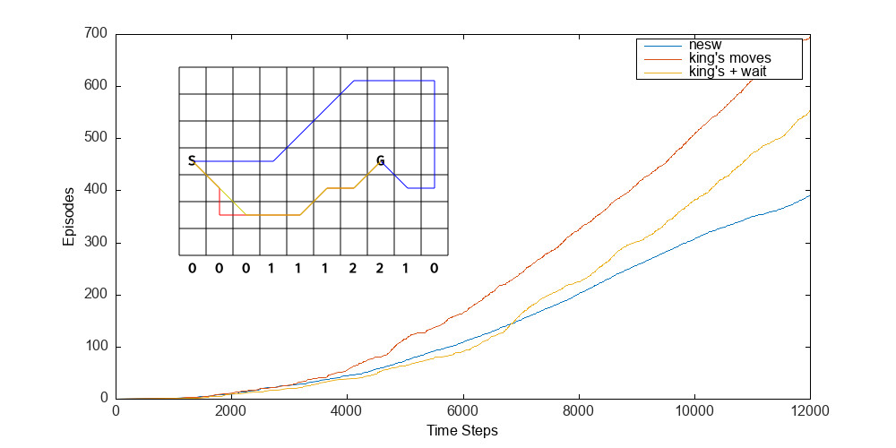

    
     
    <em>
        Consider navigating a windy grid world, where each column in the world has a
        different wind strength blowing upwards (shown at the bottom of each column). Any
        move starting in those columns will end up pushed upwards a number of cells equal
        to the starting wind strength. This image shows SARSA solving this problem:
        agents usually take the best estimated action according to some action value
        table, but spend 10% of their time randomly exploring. After each step, SARSA
        updates that action value table by using the reward that resulted from that step
        in combination with the expected reward from the next step. This
        allows agents to learn during an episode instead of afterwards. The three agents
        shown here all have different possible moves: blue can only move N, S, E, and W;
        red can move one step in eight directions, like a king in chess; yellow moves
        like red, but can also stand still. We see that yellow's extra 'wait' action
        causes it to learn slower, as it has more moves to explore, even though it
        eventually acts similar to red.
    </em>

