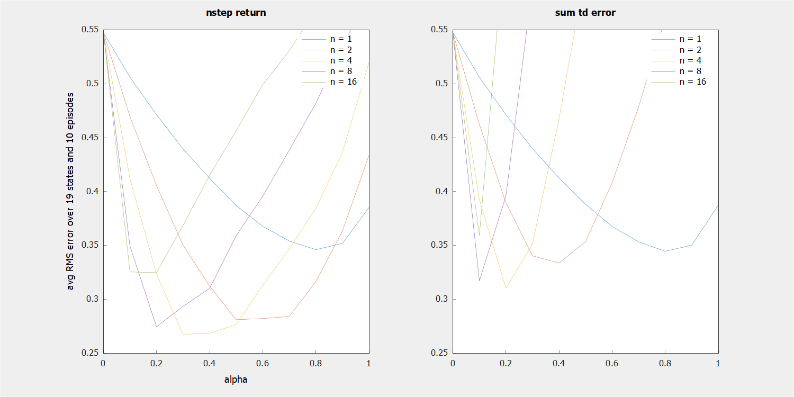

    
     
    <em>
        N-step methods update the N steps prior to each visited state, which is more general but,
        because the value estimates change each state, also causes some mathematical assumptions to
        break down. For instance, some algorithms rewrite the generalized error as the sum of TD
        errors, but this rewrite is only valid if the value estimates are static over steps. An
        experiment with known results allows us to see the cost of ignoring this assumption.
        Imagine a game where an agent randomly walks left or right at each step, starting in state
        10 of [0, 20], earning 0 in all states except 0 and 20, which both end the game and earn
        -1 and 1, respectively. The true value of each state can be calculated, and is a straight
        line from (0, -1) to (20, 1), allowing us to know the exact error in each method's value
        estimates. This error averaged over the first 10 episodes is plotted to the right for
        various values of alpha (how much each new experience updates the value estimates) and N.
    </em>

